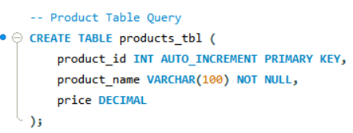
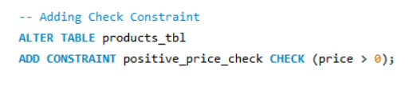
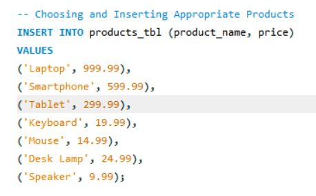
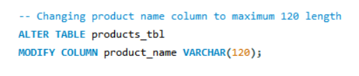
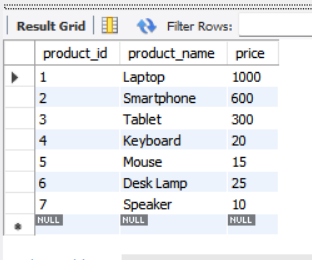
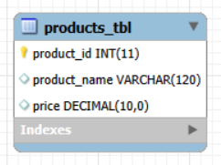

# Final Lab Task 3 Table Manipulation

In this activity, we manipulated values within a created table by applying constraints to ensure data validity. Additionally, we utilized the Alter command to modify previously entered values and update the table structure as needed, By following the guide below:

Step 1: Create the products Table

- Create a table named **products_tbl** with the following fields:

- **product_id** – An auto-incrementing primary key.

- **product_name** – A text field with a maximum length of 100 characters; cannot be blank.

- **price** – A DECIMAL value.

 Step 2: Add a Constraint
 
- Add a **CHECK constraint** to ensure that the price is greater than 0.

Step 3: Insert Valid Products

Insert the following valid product records:

- Laptop 	999.99
- Headphones -49.99
- Smartphone 	599.99
- Tablet 	299.99
- Monitor	-149.99
- Keyboard 	19.99
- Mouse	14.99
- Desk Lamp	24.99
- External Hard Drive	-79.99
- Speakers	9.99

**IMPORTANT NOTE**: Select all of the **Positive ONLY** as choosing the negative ones violates the constraint.

## Queries

1 - **Product Query**  

2 - **Adding Constraint**  

3 - **Inserting Values** (Product Table)  

4 - **Altering Product Name Up to 120 Characters**  

## Table Structure

Attached below is the Product Table along with its inserted values.

## Relational Schema

**NOTE**: In this activity, only the Product table was created. Since there are no other tables involved, it does not have any relationships or associations with other tables.
